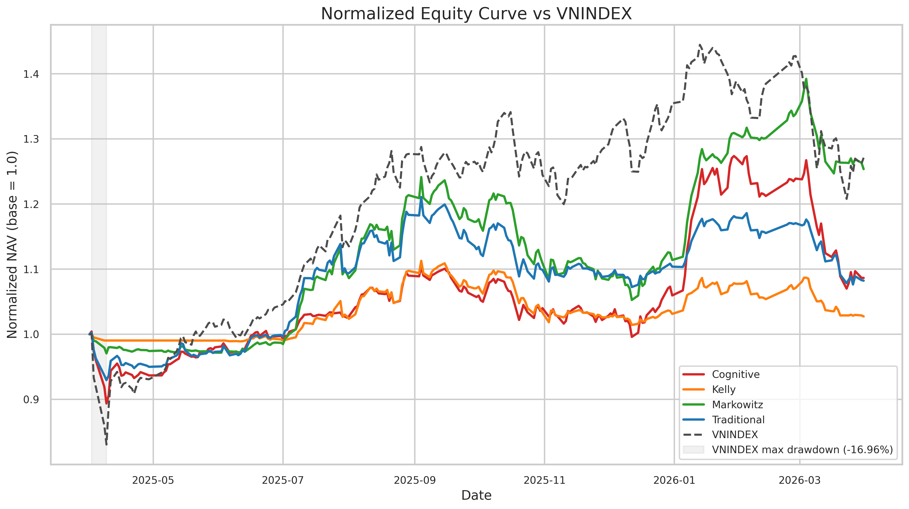
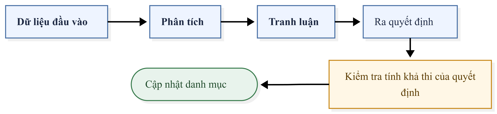

<h1 align="center">TradingAgent-VN</h1>

<p align="center">
  <strong>TradingAgent cho thị trường chứng khoán Việt Nam</strong><br/>
  CafeF News · Financial RAG · Multi-agent analysis · Backtesting
</p>

<p align="center">
  
</p>

<p align="center">
  
  
  
  
  
</p>

---

**TradingAgent-VN** là workspace mô phỏng một quỹ đầu tư AI cho chứng khoán Việt Nam. Hệ thống crawl dữ liệu giá & tin tức, đọc báo cáo tài chính, chạy nhiều agent chuyên môn hóa nhiệm vụ và để một CIO agent tổng hợp thành quyết định đầu tư.

## Mục lục

[Tính năng](#tính-năng) · [Kiến trúc](#kiến-trúc) · [Quick start](#quick-start) · [Cấu hình](#cấu-hình) · [CLI](#cli) · [Financial RAG](#financial-rag) · [Agents & Workflows](#agents--workflows) · [Dashboard](#dashboard) · [Cấu trúc dự án](#cấu-trúc-dự-án) 

## Tính năng

| | Mô tả |
|---|---|
| 📈 **Market data** | Crawl/sync OHLCV và benchmark VN30/VNINDEX vào SQLite. |
| 📰 **News intelligence** | Crawl tin tài chính (CafeF), lưu `data/news.db`, phục vụ search & agent. |
| 📄 **Financial RAG** | Index báo cáo tài chính (OCR), truy vấn theo ticker/năm/quý bằng LightRAG. |
| 🤖 **Multi-agent** | 5 agent (Macro · Technical · Quant · News · Financial) + CIO tổng hợp. |
| 🧠 **Cognitive trading** | Planner, analyst swarm, debate, governance/risk, memory & reporting. |
| 🧪 **Backtesting** | Traditional Scoring, Kelly Criterion, Markowitz Frontier, Cognitive Swarm. |
| 📊 **Research dashboard** | Leaderboard, portfolio playback, trading view và báo cáo backtest. |

## Kiến trúc chung

<p align="center">
  
</p>

## Quick start

**Yêu cầu:** Python `3.10+`, Node.js `20+`, và một LLM endpoint OpenAI-compatible (cho agent/RAG/CIO).
GPU không bắt buộc — `requirements.txt` pin PyTorch CUDA 11.8; nếu không có CUDA hãy cài bản PyTorch CPU.

```bash
# 1. Clone
git clone <your-repo-url> TradingAgent-VN && cd TradingAgent-VN

# 2. Python deps (venv)
python -m venv .venv
source .venv/bin/activate          # Windows: .\.venv\Scripts\Activate.ps1
pip install -U pip
pip install -r requirements.txt -r app/backend/requirements.txt

# 3. Frontend deps
npm --prefix app/frontend install
npm --prefix dashboard install

# 4. Cấu hình — tạo .env ở root (xem mục Cấu hình)

# 5. Khởi tạo DB + crawl dữ liệu tối thiểu
python -c "from vnstock.database.models import init_db; init_db()"
python run.py crawl-vnstock --tickers FPT,VCB,HPG --replace-existing
python run.py crawl-news --news-days 2 --source cafef
```

**Chạy app realtime** (2 terminal):

```bash
python app/start_backend.py        # backend  → http://localhost:8000
npm --prefix app/frontend run dev  # frontend → http://localhost:3001
```

> **PYTHONPATH** — nếu gặp `ImportError` khi chạy module con, set:
> ```bash
> export PYTHONPATH="$PWD:$PWD/vnstock:$PWD/tracking_news:$PWD/cognitive_trading"
> # PowerShell: $env:PYTHONPATH = "$PWD;$PWD\vnstock;$PWD\tracking_news;$PWD\cognitive_trading"
> ```

## Cấu hình

`config.py` đọc file `.env` ở root. Tạo `.env` với các biến tối thiểu:

```env
# LLM (OpenAI-compatible)
CLIPROXY_BASE_URL=http://127.0.0.1:8317/v1
CLIPROXY_API_KEY=your-api-key-here
PRIMARY_MODEL=gpt-5.2
FINANCIAL_MODEL=gpt-5.2
NEWS_MODEL=gpt-5.2

# Paths (có default, chỉ sửa nếu cần)
DATA_DIR=data
VNSTOCK_DB_PATH=data/vnstock.db
NEWS_DB_PATH=data/news.db
BACKTEST_RESULTS_DIR=backtest_results
WORKDIR=vnstock/rag_storage
```

<details>
<summary>Các nhóm config khác (trading, risk, RAG…)</summary>

| Nhóm | Biến tiêu biểu |
|---|---|
| LLM theo tier | `T2_MACRO`, `T2_NEWS`, `T3_DEBATE`, `T4_CIO`, `DAILY_REPORT`, `LLM_CONCURRENCY` |
| Trading | `PORTFOLIO_CASH`, `LOT_SIZE`, `BUY_FEE_RATE`, `SELL_FEE_RATE`, `MAX_TRADE_PCT` |
| Risk limits | `MAX_POSITION_PCT`, `MAX_DRAWDOWN_PCT`, `STOP_LOSS_PCT`, `MIN_CASH_RESERVE_PCT` |
| Strategy | `PRICE_CHANGE_THRESHOLD`, `VOL_RATIO_THRESHOLD`, `NEWS_MIN_COUNT`, `ALPHA_THRESHOLD` |
| RAG | `EMBEDDING_MODEL_NAME`, `CHUNK_SIZE`, `CHUNK_OVERLAP`, `RAG_QUERY_TIMEOUT_SECONDS` |
| Backend | `BACKEND_HOST`, `BACKEND_PORT`, `BACKEND_RELOAD` |

</details>

> ⚠️ Không commit secret thật. Giữ `.env` ở local/private.

## CLI

Entrypoint duy nhất là `run.py` (`python run.py --help`).

| Lệnh | Mục đích |
|---|---|
| `crawl-vnstock` | Sync/refresh OHLCV vào `data/vnstock.db`. |
| `crawl-news` | Crawl tin tức vào `data/news.db`. |
| `sync` (alias `prepare`) | Đồng bộ giá + tin + cache báo cáo tài chính một lần. |
| `analyze` | Sinh báo cáo phân tích tài chính Markdown. |
| `rag index \| query \| dashboard` | Index / truy vấn / mở dashboard Financial RAG. |
| `backtest` | Backtest Traditional · Kelly · Markowitz. |
| `backtest-cognitive` | Backtest cognitive swarm. |

```bash
# Crawl
python run.py crawl-vnstock --tickers VN30 --replace-existing --max-requests-per-minute 10
python run.py crawl-news --news-days 2 --source cafef

# Sync + phân tích
python run.py sync --tickers FPT,VCB --year 2025 --quarter Q4 --news-days 3
python run.py analyze --ticker FPT --year 2025 --quarter Q1   # → vnstock/analysis_reports/

# Backtest
python run.py backtest --tickers FPT,HPG,SSI,GAS,VCB --start 2026-03-24 --end 2026-03-25 \
  --workflows Traditional,Kelly,Markowitz
python run.py backtest-cognitive --tickers VN30 --start 2026-01-05 --end 2026-01-26
```

## Financial RAG

Trả lời câu hỏi từ báo cáo tài chính (OCR text) theo ticker/năm/quý bằng LightRAG.

```bash
# 1. Đặt báo cáo vào vnstock/libs/data/financial_reports/
#    Đặt tên theo mẫu: FPT-Q4-2025.ocr_text.txt  (kèm FPT-Q4-2025.pdf nếu muốn trace nguồn)

# 2. Index (mặc định khớp pattern *.ocr_text.txt)
python run.py rag index --input vnstock/libs/data/financial_reports

# 3. Query
python run.py rag query --query "Rủi ro nợ xấu của VCB trong Q4 2025?" \
  --ticker VCB --year 2025 --quarter Q4 --mode hybrid

# 4. (tuỳ chọn) Dashboard RAG
python run.py rag dashboard --port 8501          # → http://localhost:8501
```

Mode truy vấn: `global` (bối cảnh tổng thể) · `local` (entity/chunk gần) · `hybrid` (khuyến nghị).

## Agents & Workflows

**Agent chuyên gia** — chạy song song rồi đưa kết quả cho CIO:

| Agent | Vai trò |
|---|---|
| Macro | Bối cảnh vĩ mô, benchmark, sentiment tổng quát. |
| Technical | Giá, xu hướng, momentum, volume, tín hiệu kỹ thuật. |
| Quant | Mô hình định lượng, risk/return, xác suất, tín hiệu thống kê. |
| News | Tổng hợp tin & sự kiện doanh nghiệp từ `data/news.db`. |
| Financial | Phân tích fundamentals qua Financial RAG. |
| **CIO** | Tổng hợp tín hiệu, kiểm tra rủi ro, ra khuyến nghị & báo cáo cuối. |

**Workflow đầu tư:** `Traditional Scoring` (chấm điểm theo luật) · `Kelly Criterion` (tối ưu sizing) · `Markowitz Frontier` (mean-variance) · `Cognitive Swarm` (planner + swarm + debate + governance + memory).

## Dashboard

| Giao diện | Khởi chạy | URL |
|---|---|---|
| **App realtime** (`app/`) | `python app/start_backend.py` + `npm --prefix app/frontend run dev` | `http://localhost:3001` |
| **Research/backtest** (`dashboard/`) | `npm --prefix dashboard run dev` | `http://localhost:8000` |
| **MCP financial server** (tuỳ chọn) | `python -m vnstock.servers.financial_server` | — |


</details>

## Cấu trúc dự án

```text
TradingAgent-VN/
├── app/                  # FastAPI backend + Next.js realtime frontend (port 3001)
├── vnstock/              # Core: agents, DB, RAG engine, MCP server, backtest
├── cognitive_trading/    # Planner, swarm, debate, governance, memory, reporting
├── tracking_news/        # Crawler tin tức VN + MCP server + Streamlit dashboard
├── evaluation_engine/    # Metrics, diagnostics, LLM-as-judge
├── dashboard/            # Next.js research/backtest dashboard
├── data/                 # vnstock.db, news.db, cognitive.db
├── backtest_results/     # Ledgers, states, artifacts, reports
├── config.py             # Central config (đọc từ .env)
└── run.py                # CLI entrypoint
```


---

<p align="center">
  Nếu dự án hữu ích cho nghiên cứu AI agent, phân tích chứng khoán Việt Nam hoặc Financial RAG —> hãy ⭐ <strong>star repo</strong> để ủng hộ.
</p>
